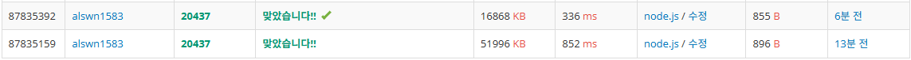

# 문제

20437 | 문자열 게임 2
https://www.acmicpc.net/problem/20437

## 문제 풀이

구현 문제
각 문자마다 있는 위치를 obj에 배열로 저장
ex) banana
obj = {
"b" : [0],
"a" : [1,3,5],
"n" : [2,4]
}
이후 K의 갯수 이상이 있는 요소들을 기준으로 문자 사이 크기를 result에 저장

result의 최솟값과 최댓값을 출력

## Map vs Object

Map과 Object를 둘 다 사용해봤는데 속도와 메모리의 차이가 꽤나 남
위가 Object를 사용, 아래가 Map을 사용

왜그런지 궁금해서 Map과 Object의 차이에 대해 알아봄
우선 여러 차이점들이 있는데 왜 위처럼 속도와 메모리의 차이가 나는지 생각해보면 우선 데이터 양이 상대적으로 작기 때문이라는 결과에 도달
성능적인 면에서 Map이 좋지만 여러 기능들을 제공해주시 때문에 메모리 사용이 더 많을 수 있음
성능적인 면에서도 Map이 데이터 양이 많아질수록 Object에 비해 더 좋아지는 것

암튼 결론은 작은 데이터에 사용할때는 object가 더 빠를 수 있다.

## 참고 자료

https://developer.mozilla.org/ko/docs/Web/JavaScript/Reference/Global_Objects/Map
https://jake-seo-dev.tistory.com/348
