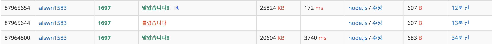

# 문제

1697 | 숨바꼭질
https://www.acmicpc.net/problem/1697

## 문제 풀이

BFS or DP

### BFS 풀이

```javascript
function bfs(start, target) {
  const queue = [[start, 0]];
  const visited = new Array(100001).fill(false);
  visited[start] = true;

  while (queue.length) {
    const [current, time] = queue.shift();

    if (current === target) {
      return time;
    }

    for (const idx of [current - 1, current + 1, current * 2]) {
      if (idx >= 0 && idx <= 100000 && !visited[idx]) {
        visited[idx] = true;
        queue.push([idx, time + 1]);
      }
    }
  }
}

console.log(bfs(N, K));
```

1. queue에 start - 1, start + 1, start \* 2값과 time을 합친 배열을 계속 쌓는다
2. 하나씩 꺼내며 target과 일치하는 값을 찾음
3. visited 배열을 둬 이미 방문한 것은 queue에 더 추가하지 않음 ( 이미 최소값이기 때문에 더 확인할 필요가 없음, 중복 확인 방지 )

### DP

DP는 알고리즘보다는 설계 기법
참고자료 : https://dense.tistory.com/entry/dp

```javascript
function solution(start, target) {
  const dp = new Array(1000000).fill(Infinity);

  for (let i = 0; i < start; i++) {
    dp[i] = start - i;
  }

  dp[start] = 0;

  for (let i = start + 1; i <= target; i++) {
    if (i % 2 === 0) {
      dp[i] = Math.min(dp[i >> 1], dp[i - 1]) + 1;
    } else {
      dp[i] = Math.min(dp[i - 1] + 1, dp[(i - 1) >> 1] + 2);
    }
  }

  console.log(dp[target]);
}
solution(N, K);
```

1. 앞의 값들을 이용해 최소값들을 구함
2. 최솟값을 구해야하므로 Infinity로 기본 값들을 채워 넣음
3. 앞의 값들을 이용해야되기 때문에 앞의 값들을 우선 채워넣음
4. 비트 연산자 >>는 Math.floor(i/2)보다 빠름

### BFS 방식 VS DP 방식 비교


위에가 DP 아래가 BFS를 사용한건데 DP방식을 사용한 것이 훨씬 더 빠름
