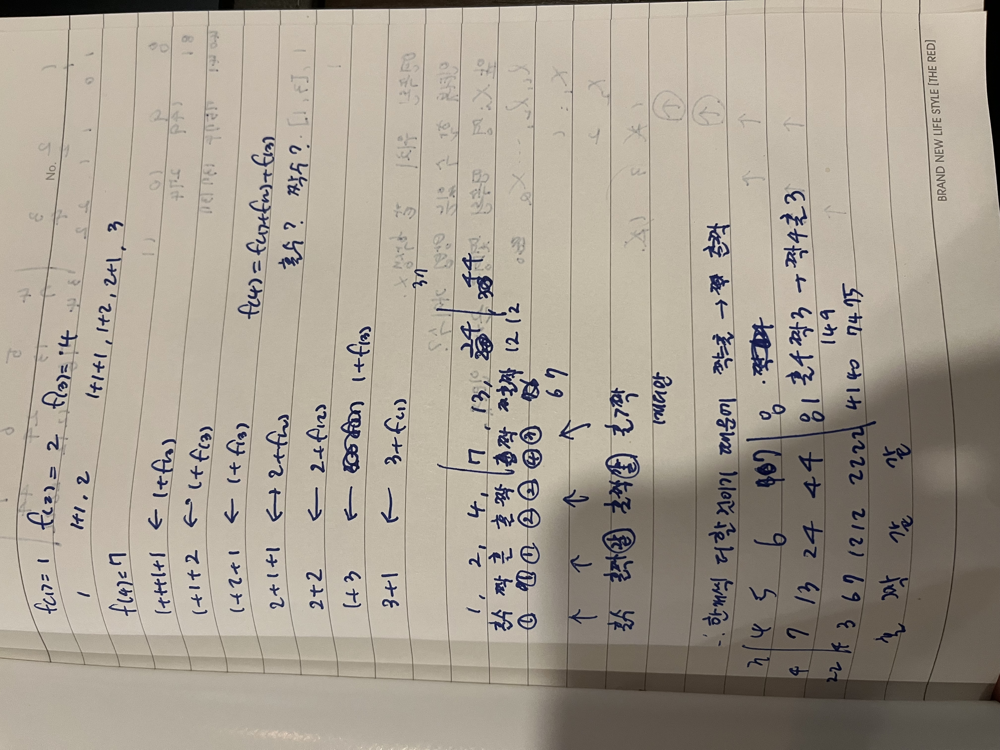

# 문제

15993 | 1, 2, 3 더하기 8
https://www.acmicpc.net/problem/15993

## 문제 풀이

f(n) = f(n-3) + f(n-2) + f(n-1)의 규칙을 갖음

종이에 써보며 규칙을 찾음
홀수 -> 짝수, 짝수 -> 홀수 이런식으로 됨 ( 한개가 추가되기 때문 )

처음에는 매번 값을 구하는 방식으로 구현했는데 시간 초과가 떠서 미리 다 구해놓고 값을 구하는 방식으로 변경
