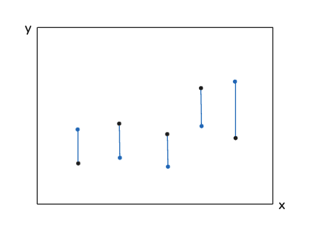

## 문제
 
$2$차원 평면 위에 주어진 
$N$개의 점 각각을 한 끝점으로 하고, 주어지지 않은 점을 다른 끝점으로 하는 선분을 
$N$개 만들어 서로 교차하지 않게 해 보자. 
$2N$개의 점은 모두 정수 좌표의 점이며, 서로 같은 좌표에 있으면 안 된다.

어떤 선분의 끝점이 다른 선분 위에 있거나, 두 선분이 끝점에서 만나면 교차하는 경우로 본다.

### 입력
총 
$T$개의 테스트 케이스가 입력으로 주어지며, 첫째 줄에 
$T$가 주어진다. 
$(1 \le T \le 1\,000)$ 

테스트 케이스의 첫째 줄에 
$N$이 주어진다. 
$(1 \le N \le 100)$ 

테스트 케이스의 둘째 줄부터 
$N$개의 점이 주어진다. 그중 
$i$번째 줄에는 
$i$번 점의 좌표 정수 
$x_i$, 
$y_i$가 공백으로 구분되어 주어진다. 
$(-10^8 \le x_i, y_i \le 10^8)$ 

주어지는 모든 점의 좌표는 서로 다르다.

입력으로 주어지는 점들을 이용해 선분 
$N$개를 서로 교차하지 않게 항상 만들 수 있음을 보장한다.

### 출력
각 테스트 케이스마다 
$N$개의 줄에 걸쳐 교차하지 않는 
$N$개의 선분을 출력한다.

그중 
$j$번째 줄에는 주어진 점의 번호 
$p_j$와 주어지지 않은 점의 좌표 정수 
$x_j$, 
$y_j$를 공백으로 구분하여 출력한다. 이는 주어진 
$p_j$번 점과 
$(x_j, y_j)$의 점이 선분을 이루었다는 의미이다. 출력하는 
$p_j$는 서로 달라야 한다. 
$(1 \le p_j \le N$; 
$-10^9 \le x_j, y_j \le 10^9)$ 

가능한 경우가 여럿인 경우는 그중 아무거나 하나를 출력한다.

## 문제 풀이
- 모든 주어진 점과 다른 점을 연결한 선분들이 교차하지 않도록 해야한다.
- 주어진 점의 x, y 범위랑 새로 찍는 점의 x, y 범위가 다르다.
  - 주어진 점은 x, y 값이 `-10**8 ~ 10**8` 사이고, 새로운 점은 `-10**9 ~ 10**9`이다.
- 만약 모든 주어진 점의 x좌표가 다를 때를 생각한다면 다음과 같다.
  
  - 위 그림에서 검정색 점이 원래 주어진 점이라면 새로운 점은 x좌표를 동일하게 정해주고 y좌표만 아무 정수값으로 지정해주면 선분은 교차하지 않는다.
- 그러나 문제에서는 x좌표가 동일한 케이스도 있다. 그렇기 때문에 x좌표가 동일한 경우 새로운 점을 찍으려면 선분의 기울기가 동일하게 찍어야한다.
- 그런데 기울기를 똑같게 하기 위해 점을 찍으려면 다른 점과 교차하지 않아야한다.
  - 그렇게 하기 위해서 위의 조건인 범위를 이용한다. 기존 점은 `-10**8 ~ -10**8` 사이에 있으니까 해당 범위 위에 점이 존재하도록 하는 것이고, x좌표는 1만 증가시켜준 값으로 정하면된다.
  - x좌표를 1보다 큰 값으로 정해두게 되면 해당 선분이 기존에 있던 다른 점과 만날 수 있기 때문에 +1만 해준다.
- 기존의 y좌표의 최저값은 -10**8이기 때문에 10**8보다 위에 있게 하려면 최소 `2*10**8+1`을 더해주면 된다. 
- 따라서, (x+1, y+2*10**8+1)을 해주면 된다.